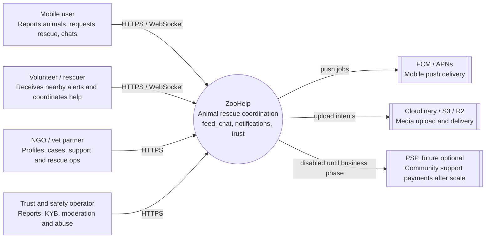
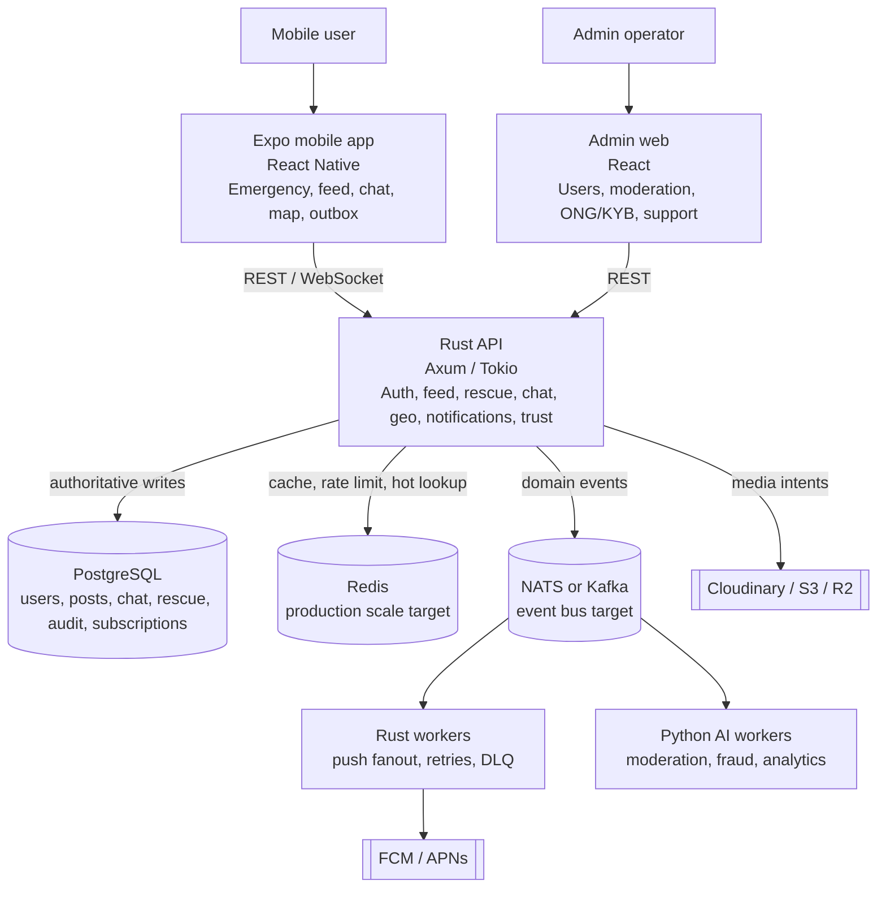
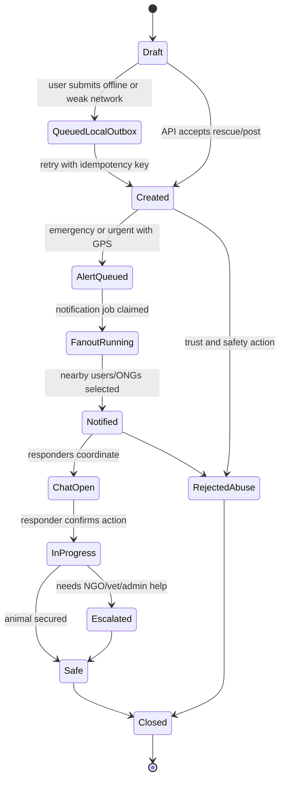
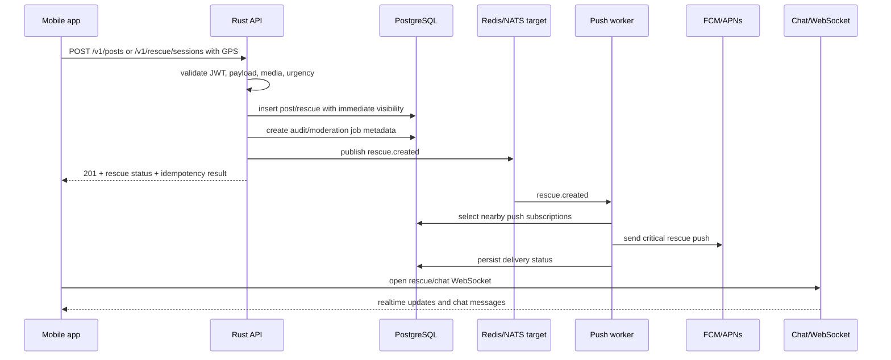
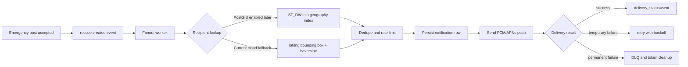
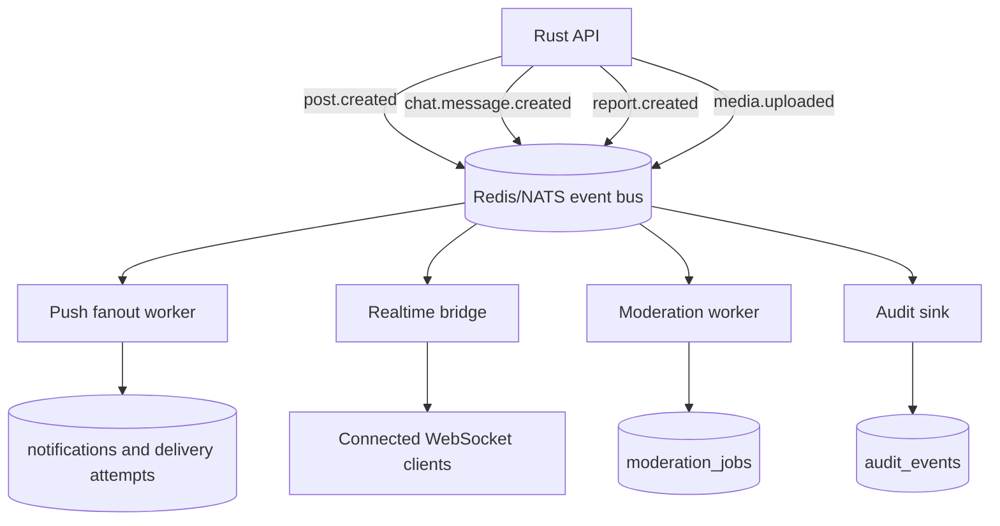
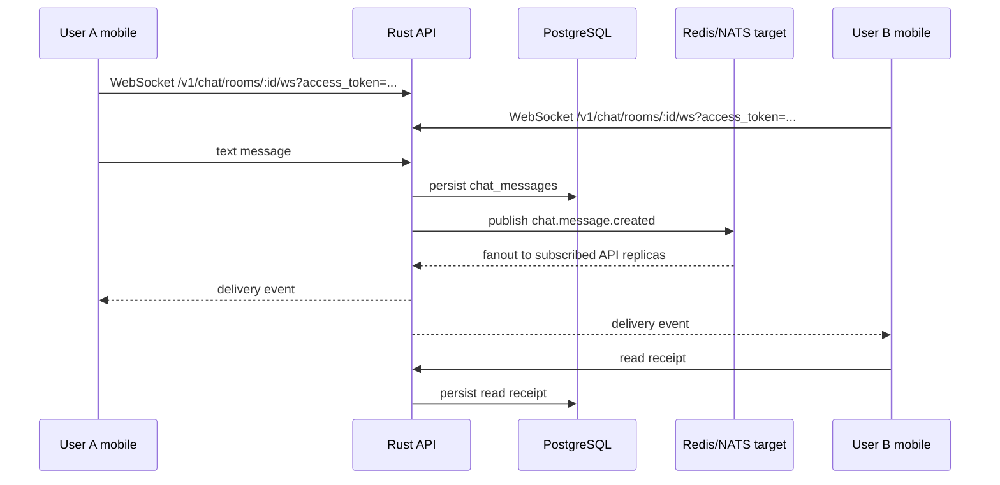
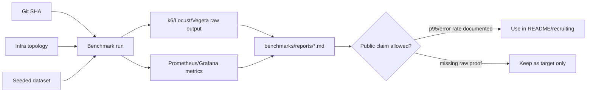

# ZooHelp Visual Architecture

These diagrams are source-controlled architecture assets for reviewers, contributors, and recruiting conversations.

They describe the intended production shape while keeping current constraints explicit: PostGIS can be enabled later, Redis/NATS fanout is the scale target, and public performance claims require benchmark reports.

## C4 Context

## C4 Container

## Rescue Lifecycle

## Rescue Creation Sequence

## Notification Flow

## Event Flow

## Chat Realtime Flow

## Benchmark Evidence Flow

